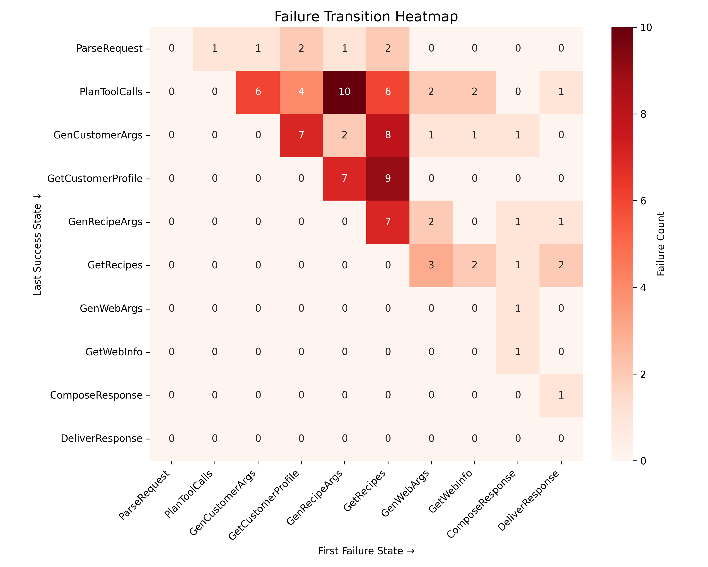

# Building an Evaluation Pipeline for an AI Recipe Bot

**LLM applications don't crash. They degrade silently.** A traditional bug throws an exception. An LLM failure looks like a polite, confident, wrong answer. The user gets a response. It just happens to be incorrect, incomplete, or hallucinated.

This project is a complete evaluation pipeline built around a Recipe Bot chatbot, covering manual error discovery, automated LLM-as-judge measurement, retrieval evaluation, and agent failure diagnosis. It demonstrates that you cannot tell if an AI product is working by looking at whether it responds. You need a separate system to measure whether the responses are *good*.

Built during the [AI Evals For Engineers & PMs](https://maven.com/applied-llms/ai-evals) course by Hamel Husain & Shreya Shankar on Maven.

---

## What's Inside

A Recipe Bot that takes dietary queries ("gluten-free dinner for four") and returns recipes. Four progressive evaluation layers, each revealing failures the previous layer couldn't see:

| Evaluation | What It Does | Key Result |
|-----------|-------------|-----------|
| [**Error Analysis**](evaluations/01-error-analysis/) | Manual review of 100 traces | **~47% pass rate**, 4 failure mode categories discovered |
| [**LLM-as-Judge**](evaluations/02-llm-judge/) | Automated evaluation pipeline | **62.6% corrected pass rate** (95% CI: 53-73%) on 439 traces |
| [**Retrieval**](evaluations/03-retrieval/) | BM25 evaluation + query rewriting | **Recall@5 lifted from 81% to 91%** with keyword rewrite strategy |
| [**Agent Diagnosis**](evaluations/04-agent-diagnosis/) | Failure transition analysis | **28% of failures traced to 2 root causes** across 3 user queries |

---

## The Evaluation Stack

```
Layer 4 | Agent Failure Diagnosis
        | Where does quality silently degrade across pipeline states?
        ┌─────────────────────────────────────────────────────┐
Layer 3 │ Retrieval Evaluation                                │
        │ Does the system find the right recipes?             │
        ├─────────────────────────────────────────────────────┤
Layer 2 │ Automated LLM-as-Judge                              │
        │ Repeatable, statistically corrected measurement     │
        ├─────────────────────────────────────────────────────┤
Layer 1 │ Manual Error Analysis                               │
        │ Broad discovery: what failure modes exist?          │
        └─────────────────────────────────────────────────────┘
```

Each layer answers a question the layer below can't. Manual analysis tells you "here's how it fails." Automated judging tells you "here's how often, with confidence intervals." Retrieval eval tells you "is it even finding the right recipes?" Agent diagnosis tells you "where in the pipeline does quality break?"

---

## The Journey

### Error Analysis: Go Broad First

Ran Recipe Bot on 100 synthetic queries spanning dietary restrictions, time constraints, skill levels, and ingredient limitations. Manually reviewed every trace using open and axial coding.

**~47% pass rate.** Four failure mode categories: user constraints ignored (32% of failures), LLM service blocked by risk screening (16%), unclear language, and incomplete structure.

The insight: broad evaluation answers "where does it break?" and "what to fix first?" Not a single quality number, but a prioritized failure taxonomy.

> [Failure mode taxonomy](evaluations/01-error-analysis/failure_mode_taxonomy.md) · [Error analysis data](evaluations/01-error-analysis/error_analysis.csv)

### LLM-as-Judge: Narrow Down and Build an Automated Pipeline

Picked one dimension from the error analysis, **dietary adherence**, and built a full measurement pipeline:

1. Generated **439 traces** from our Recipe Bot (not reference traces, our model, our prompt)
2. Manually labeled **241 traces** as ground truth (161 PASS / 80 FAIL)
3. Engineered a judge prompt, iterated on a dev set (TPR improved from 68.8% to 82.2% after one iteration)
4. Calibrated on a held-out test set: **TPR 82.2%, TNR 88.9%, Balanced Accuracy 85.5%**
5. Ran the judge on all 439 traces and applied statistical bias correction via [`judgy`](https://github.com/HamelHusain/judgy)

**Result: 62.6% corrected pass rate, 95% CI [53.0%, 72.8%].**

The correction matters: our judge has a slight false-negative bias (misses some PASSes), so `judgy` corrects upward from the raw 55.6%. The wide CI reflects 439 traces. You'd need ~1000+ to tighten to ±5pp.

> [Full narrative](evaluations/02-llm-judge/results/evaluation_narrative.md) · [Judge prompt](evaluations/02-llm-judge/results/judge_prompt.txt) · [Final evaluation](evaluations/02-llm-judge/results/final_evaluation.json)

### Retrieval: Evaluate and Improve Recipe Search

Built and evaluated a BM25 retrieval system. Generated **193 synthetic queries** via a 2-step LLM pipeline (extract salient fact, then generate query). Tested three LLM query rewrite strategies:

| Strategy | Recall@5 | MRR |
|----------|----------|-----|
| BM25 baseline | 81.3% | 0.704 |
| + keywords rewrite | **91.2%** | **0.785** |
| + full rewrite | 83.4% | 0.705 |
| + expand (synonyms) | 74.6% | 0.641 |

**Keywords won** because it strips conversational noise and lets BM25 focus on rare discriminative terms. Expand *hurt* performance because adding synonyms dilutes rare-term scores in lexical search. More is not better.

16 queries rescued by keywords rewrite, only 2 degraded. At scale, the 10pp Recall improvement means tens of thousands fewer incorrect dietary answers per day.

> [Full analysis](evaluations/03-retrieval/results/hw4_analysis.md) · [Retrieval comparison data](evaluations/03-retrieval/results/retrieval_comparison.json)

### Agent Diagnosis: Where Quality Silently Degrades

Given 96 pre-labeled agent traces, each containing exactly one silent failure, built a transition matrix showing where the agent succeeds last and fails first across 10 internal pipeline states.



The top 3 cells account for **27 of 96 failures (28%)**. Drilling in reveals all 27 traces come from the same 3 user queries. The heatmap looks like many failure modes. It's actually **one root cause repeated**: the system has no reliable path for dietary-restriction queries.

Two distinct failure clusters with different owners:

| Cluster | What Breaks | Fix | Owner |
|---------|------------|-----|-------|
| Schema translation failure | Agent can't convert dietary query to structured search args | Improve GenRecipeArgs prompt/schema | ML/Prompt engineer |
| Corpus coverage gap | Recipe DB returns empty for dietary queries | Add gluten-free/vegetarian/oatmeal recipes | Content/Data team |

The key insight: **the agent keeps talking after it fails.** After the failure point, the assistant continues responding and the conversation looks complete. The user gets a polite deflection ("try again later!") instead of an error. No crash, no alert, no ticket. At 1M users/day, you don't know it's happening unless you have an eval pipeline running.

> [Full analysis](evaluations/04-agent-diagnosis/results/analysis.md) · [Interactive trace explorer](evaluations/04-agent-diagnosis/results/trace_explorer.html) (open in browser)

---

## Key Takeaways

1. **Evaluation is infrastructure, not a post-launch activity.** Without automated measurement and agent diagnosis, you have zero visibility into silent failures at scale. The eval pipeline *is* the instrumentation layer.

2. **Go broad before going narrow.** Manual error analysis identified the failure landscape. The LLM-as-judge then measured one dimension precisely. Skipping broad discovery means you automate the wrong thing.

3. **Statistical correction matters.** Raw judge output said 55.6% pass. Bias-corrected answer: 62.6%. A 7pp difference changes your launch decision.

4. **Silent failures are more dangerous than crashes.** A crash shows up in error logs. A polite, wrong answer only shows up in your eval pipeline, churn data, or user research. Uptime monitoring tells you nothing.

5. **Retrieval is a product multiplier.** A simple keyword rewrite lifted Recall@5 by 10pp. The corpus becomes a product lever you can operate independently of the model: add recipes without retraining, audit which recipe answered any question, A/B test recipe versions.

---

## Project Structure

```
├── evaluations/
│   ├── 01-error-analysis/          # Manual review of 100 traces
│   │   ├── failure_mode_taxonomy.md
│   │   └── error_analysis.csv
│   ├── 02-llm-judge/               # Automated evaluation pipeline
│   │   ├── scripts/                # 8 pipeline scripts
│   │   ├── data/                   # Traces, labels, train/dev/test splits
│   │   └── results/                # Judge calibration & final evaluation
│   ├── 03-retrieval/               # BM25 evaluation + query rewriting
│   │   ├── scripts/                # Query generation & evaluation
│   │   ├── data/                   # Synthetic queries, recipe corpus
│   │   └── results/                # Retrieval comparison data
│   └── 04-agent-diagnosis/         # Failure transition analysis
│       ├── data/                   # Labeled agent traces
│       └── results/                # Heatmap, interactive explorer, analysis
├── backend/                        # Recipe Bot FastAPI app
│   ├── prompts/                    # System prompt
│   ├── retrieval.py                # BM25 recipe search
│   └── ...                         # LiteLLM integration, query rewriting
├── frontend/                       # Chat UI
├── data/                           # Sample queries
├── scripts/                        # Utility scripts
├── EVALS_PLAYBOOK.md               # 15-chapter deep dive on AI evaluation
└── DEVELOPMENT_LOG.md              # Build log
```

## How to Run

```bash
git clone <repo-url>
cd chat-agent-llm-evaluation-pipeline
python -m venv .venv && source .venv/bin/activate
pip install -r requirements.txt
cp env.example .env  # Add your API keys

# Run the Recipe Bot
uvicorn backend.main:app --reload  # opens at http://127.0.0.1:8000

# Run any evaluation pipeline (e.g., LLM-as-Judge)
python evaluations/02-llm-judge/scripts/generate_traces.py
python evaluations/02-llm-judge/scripts/run_full_evaluation.py
```

See [LiteLLM docs](https://docs.litellm.ai/docs/providers) for supported model providers.

---

## Deep Dive

For a comprehensive 15-chapter reference covering everything from evaluation foundations through production patterns, see [EVALS_PLAYBOOK.md](EVALS_PLAYBOOK.md).

---

*Built during [AI Evals For Engineers & PMs](https://maven.com/applied-llms/ai-evals) by Hamel Husain & Shreya Shankar on Maven.*
